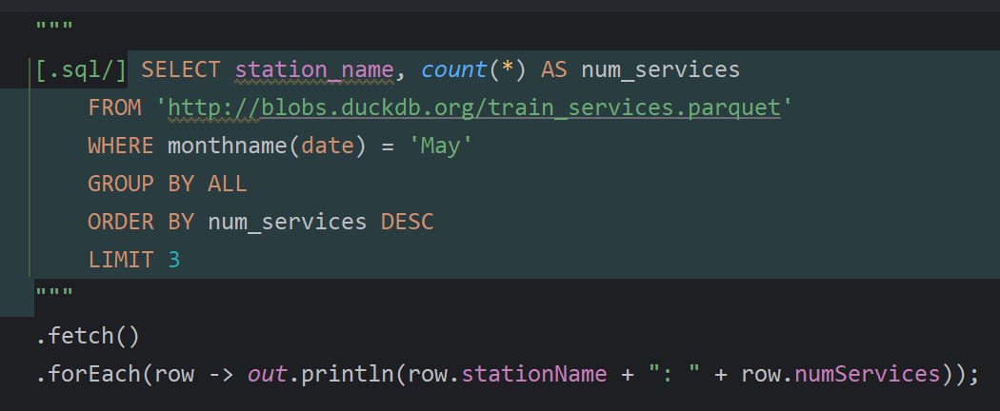
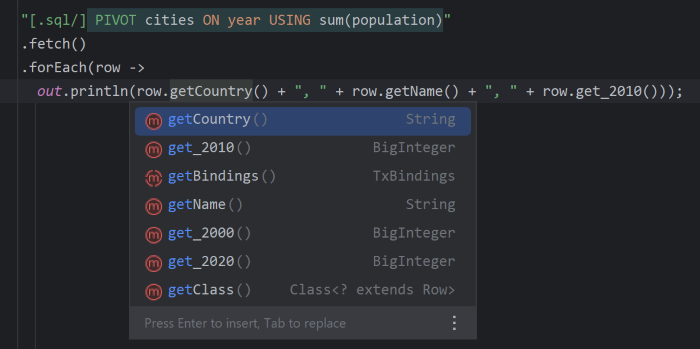
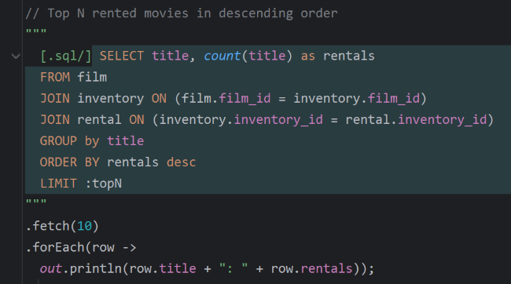
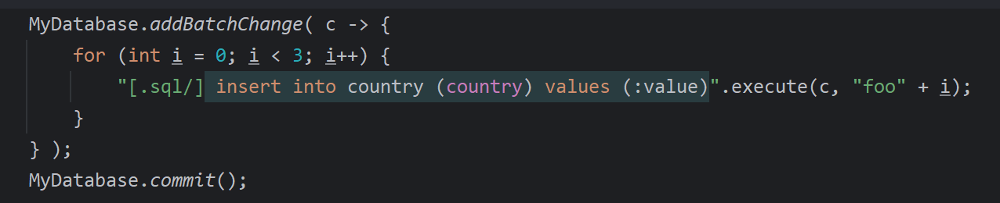
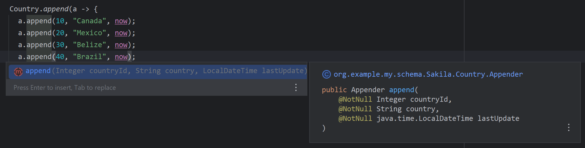
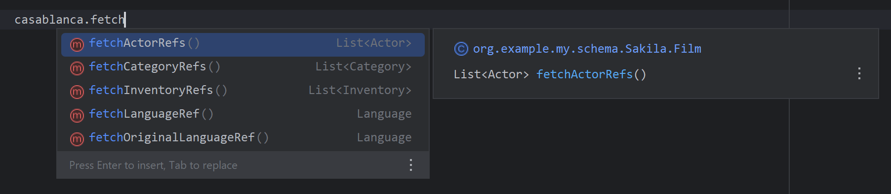

# Type-safe analytical SQL with DuckDB and Manifold

With [manifold-sql](https://github.com/manifold-systems/manifold/blob/master/manifold-deps-parent/manifold-sql/readme.md),
DuckDB's productive SQL extensions are directly and type-safely integrated with Java and IntelliJ IDEA.

---
Query types are instantly available as you type native SQL of any complexity in your Java code.

><p></p>

---
DuckDB's SQL extensions are type-safe and fully integrated with code completion, usage searching, etc.

><p></p>

---
Parameterized queries are type-safe & sql-injection safe

><p></p>

---
Execute any type of SQL statement type-safely, either directly or in a batch. 

><p></p>

---
manifold-sql streamlines DuckDB's additional APIs for a simpler, type-safe dev experience. For instance,
the Appender API is made straightforward and foolproof.

><p></p>

---
Entity types are automatically derived from your database, providing type-safe CRUD, decoupled
TX, and a lot more.  

```java
Language english = Language.create("English");

Film casablanca = Film.builder("Casablanca", english)
  .withReleaseYear(1942)
  .build();

MyDatabase.commit();

// all generated columns, foreign keys, etc. are auto-assigned after commit
casablanca.getLanguageId();
```               

---
Code completion supplies type-safe access to column properties for both entities and queries.

><p></p>

---
Quick, type-safe access to foreign key relations.

><p></p>

---
## Adding manifold-sql & DuckDB to your project.

Manifold SQL consists of two modules, add them as dependencies.
* `systems.manifold:manifold-sql-rt`: (Gradle: "implementation", Maven: "compile")
* `systems.manifold:manifold-sql`: (Gradle: "annotationProcessor", Maven: a path in "annotationProcessorPaths")

DuckDB is a JDBC driver, add it as a dependency.
* `org.duckdb:duckdb_jdbc`: (Gradle: both "implementation" & "annotationProcessor", Maven: both "compile" & a path in "annotationProcessorPaths")  

There is also a javac plugin, it must be added using a compiler argument.
* `-Xplugin:Manifold` 


Sample build files for Gradle and Maven follow.

## Gradle

Here is a sample `build.gradle` script. Change `targetCompatibility` and `sourceCompatibility` to your desired JDK LTS
version (8 - 21, or latest non-LTS release), the script takes care of the rest.
```groovy
plugins {
    id 'java'
}

group 'systems.manifold'
version '1.0-SNAPSHOT'

// manifold-sql works with any JDK LTS release 8 - 21, plus latest non-LTS release
targetCompatibility = 11
sourceCompatibility = 11

repositories {
    jcenter()
    maven { url 'https://oss.sonatype.org/content/repositories/snapshots/' }
}

dependencies {
    
     // Manifold SQL dependencies    
     implementation 'systems.manifold:manifold-sql-rt:2025.1.4'
     annotationProcessor 'systems.manifold:manifold-sql:2025.1.4'
     testAnnotationProcessor 'systems.manifold:manifold-sql:2025.1.4'

     // DuckDB dependencies
     implementation 'org.duckdb:duckdb_jdbc:1.0.0'
     annotationProcessor 'org.duckdb:duckdb_jdbc:1.0.0'
     testAnnotationProcessor 'org.duckdb:duckdb_jdbc:1.0.0'
}

if (JavaVersion.current() != JavaVersion.VERSION_1_8 &&
    sourceSets.main.allJava.files.any {it.name == "module-info.java"}) {
    tasks.withType(JavaCompile) {
        // if you DO define a module-info.java file:
        options.compilerArgs += ['-Xplugin:Manifold', '--module-path', it.classpath.asPath]
    }
} else {
    tasks.withType(JavaCompile) {
        // If you DO NOT define a module-info.java file:
        options.compilerArgs += ['-Xplugin:Manifold']
    }
}
```
Use with accompanying `settings.gradle` file:
```groovy
rootProject.name = 'MyProject'
```

## Maven

```xml
<?xml version="1.0" encoding="UTF-8"?>
<project xmlns="http://maven.apache.org/POM/4.0.0" xmlns:xsi="http://www.w3.org/2001/XMLSchema-instance" xsi:schemaLocation="http://maven.apache.org/POM/4.0.0 http://maven.apache.org/maven-v4_0_0.xsd">
    <modelVersion>4.0.0</modelVersion>

    <groupId>com.example</groupId>
    <artifactId>my-sql-app</artifactId>
    <version>0.1-SNAPSHOT</version>

    <name>My App</name>

    <properties>
        <!-- set latest manifold version here --> 
        <manifold.version>2025.1.4</manifold.version>
      
        <!-- use maven.compiler settings for JDK LST release 11 - 21, or latest non-LTS release -->
        <maven.compiler.source>11</maven.compiler.source>
        <maven.compiler.target>11</maven.compiler.target>
    </properties>
    
    <dependencies>
        <!-- dependency for manifold-sql-rt -->
        <dependency>
            <groupId>systems.manifold</groupId>
            <artifactId>manifold-sql-rt</artifactId>
            <version>${manifold.version}</version>
        </dependency>

        <!-- dependency for DuckDB JDBC driver -->
        <dependency>
            <groupId>org.duckdb</groupId>
            <artifactId>duckdb_jdbc</artifactId>
            <version>1.0.0</version>
        </dependency>

    </dependencies>

    <!--Add the -Xplugin:Manifold argument for the javac compiler-->
    <build>
        <plugins>
            <plugin>
                <groupId>org.apache.maven.plugins</groupId>
                <artifactId>maven-compiler-plugin</artifactId>
                <version>3.8.0</version>
                <configuration>
                  
<!-- use maven.compiler.source/target properties above if using JDK 11+, otherwise use following JDK 8 setting -->
<!--                <source>1.8</source>-->
<!--                <target>1.8</target>-->
                  
                    <encoding>UTF-8</encoding>
                    <compilerArgs>
                        <!-- Add manifold plugin-->
                        <arg>-Xplugin:Manifold</arg>
                    </compilerArgs>
                    <!-- Add the processor path for the plugin -->
                    <annotationProcessorPaths>
                        <!-- dependency for manifold-sql -->
                        <path>
                            <groupId>systems.manifold</groupId>
                            <artifactId>manifold-sql</artifactId>
                            <version>${manifold.version}</version>
                        </path>

                        <!-- dependency for DuckDB JDBC driver -->
                        <path>
                            <groupId>org.duckdb</groupId>
                            <artifactId>duckdb_jdbc</artifactId>
                            <version>1.0.0</version>
                        </path>
                    </annotationProcessorPaths>
                </configuration>
            </plugin>
        </plugins>
    </build>
</project>
```

---
Learn more about manifold-sql [here](https://github.com/manifold-systems/manifold/blob/master/manifold-deps-parent/manifold-sql/readme.md).

