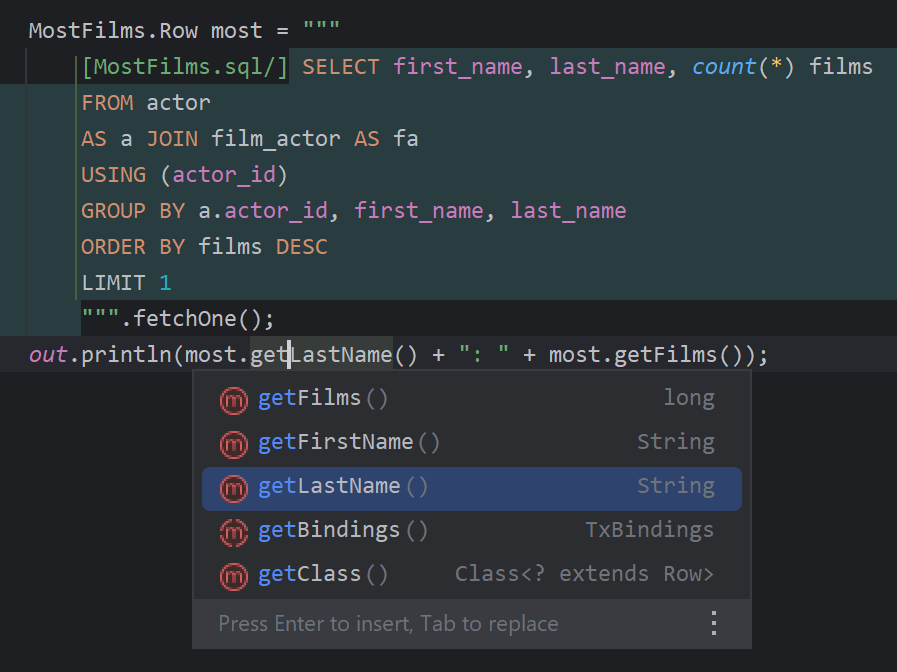
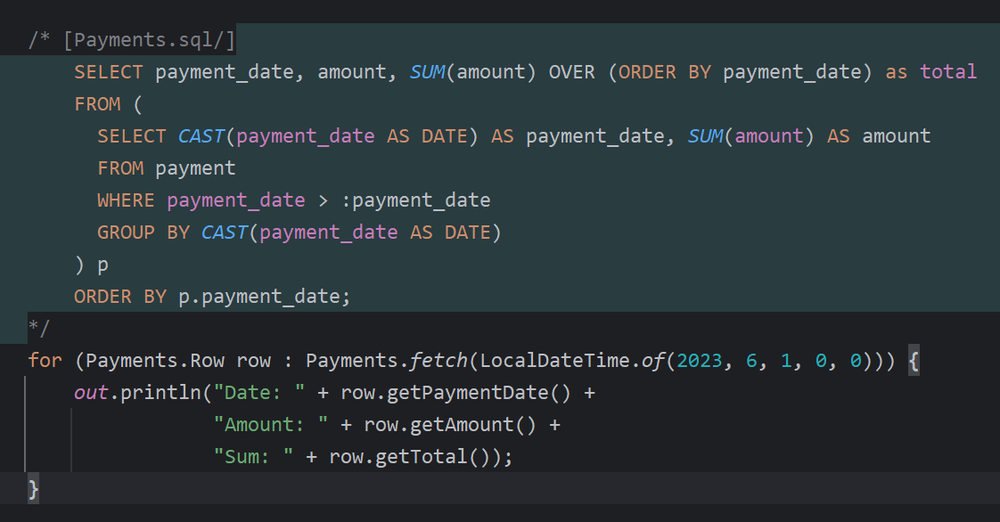

>**⚠ _Experimental Feature_**

# Manifold : SQL

Manifold SQL is a lightweight yet powerful alternative to existing JDBC persistence frameworks that makes it possible to
use native SQL _directly_ and _type-safely_ from Java code.

- Query types are instantly available as you type native SQL of any complexity in your Java code
- Query results are type-safe and type-rich and simple to use (see examples below)
- Entity types are automatically derived from JDBC metadata via compiler plugin, fully relational/FK aware, CRUD, etc.
- No ORM, No DSLs, No annotations, and No code generation build steps

Use Manifold simply by adding the javac `-Xplugin:Manifold` argument and `manifold-sql` and `manifold-sql-rt` dependencies
to your gradle or maven build.

---

## Features:
- Use native SQL directly and type-safely in your Java code 
- _Inline_ SQL directly in Java source, or use .sql files 
- Type-safe DDL &bull; Type-safe queries &bull; Type-safe results 
- Full CRUD support with DB schema type projections, without writing a line of code 
- No code gen build steps &bull; No ORM shenanigans &bull; No DSL mumbo-jumbo 
- Managed transaction scoping, commit/revert entity changes as needed 
- Pluggable architecture with simple dependency injection 
- Tested with popular JDBC database drivers and SQL dialects 
- Comprehensive IDE support (IntelliJ IDEA, Android Studio)
- Supports Java 8 - 21 (LTS releases)

### Examples

If all of a table's non-null columns are selected, such as with `select *` queries, the entity type is used in the result
row. Also, notice the use of the type-safe, injection-safe query parameter `:release_year`. Parameters are available
in all SQL commands including `Insert`, `Update`, `Delete` as well as `Select`.

 

---
You can inline SQL queries and commands in both standard Strings Literals and Text Blocks. This query demonstrates how
you can use native SQL to produce result sets of any type. Notice both Java and SQL syntax is highlighted. The Manifold
IntelliJ IDEA plugin integrates comprehensively with IDEA's SQL features.

 

---
An inline query can also be declarative using comment delimiters. Here the `Payments` query type is defined and used
in the same scope. Notice the type name, `Payments.sql`. The format follows the file naming convention where the type name
precedes the type _domain_. In this case the name is `Payments` and the domain is `sql`. As such SQL types can be defined
in resource files as well as inlined types.

 

## How does it work?
 
Manifold SQL plugs into the java compiler using the `jdk.compiler.Plugin` SPI. This hook enables the framework to intercept
the compiler's type resolver so that it can produce schema and query types on-demand as the compiler encounters them. This
aspect of the framework can be thought of as a _just-in-time_ type generator. It makes automatic entity projection and inline,
type-safe SQL a reality. Similar features in other languages include Type Providers in F#, Source Generators in C#, and 
Gosu's Open Type System.
     
A standard JDBC connection supplies the metadata backing the schema and query types. This is configurable using a simple
JSON `.dbconfig` file, which provides a JDBC URL, driver properties, and other optional settings. Importantly, since the
connection is used only for static analysis during compilation, the database can be void of data.
                                                      
Using metadata acquired directly from a JDBC connection guarantees the schema entities, SQL queries, and commands you use
are 100% type-safe and compatible with your database. Additionally, it allows Manifold SQL to target a much wider range
of database products.
           
## Full documentation on the way. . .

## Coming _**real**_ soon. . .
                                   
> This project is nearing a preview release. A healthy round of tire kicking and general feedback is needed. If you
> would like to participate, please shoot an email to [info@manifold.systems](mailto:info@manifold.systems) or send a
> direct message to Scott McKinney on our [slack](https://join.slack.com/t/manifold-group/shared_invite/zt-e0bq8xtu-93ASQa~a8qe0KDhOoD6Bgg). 

