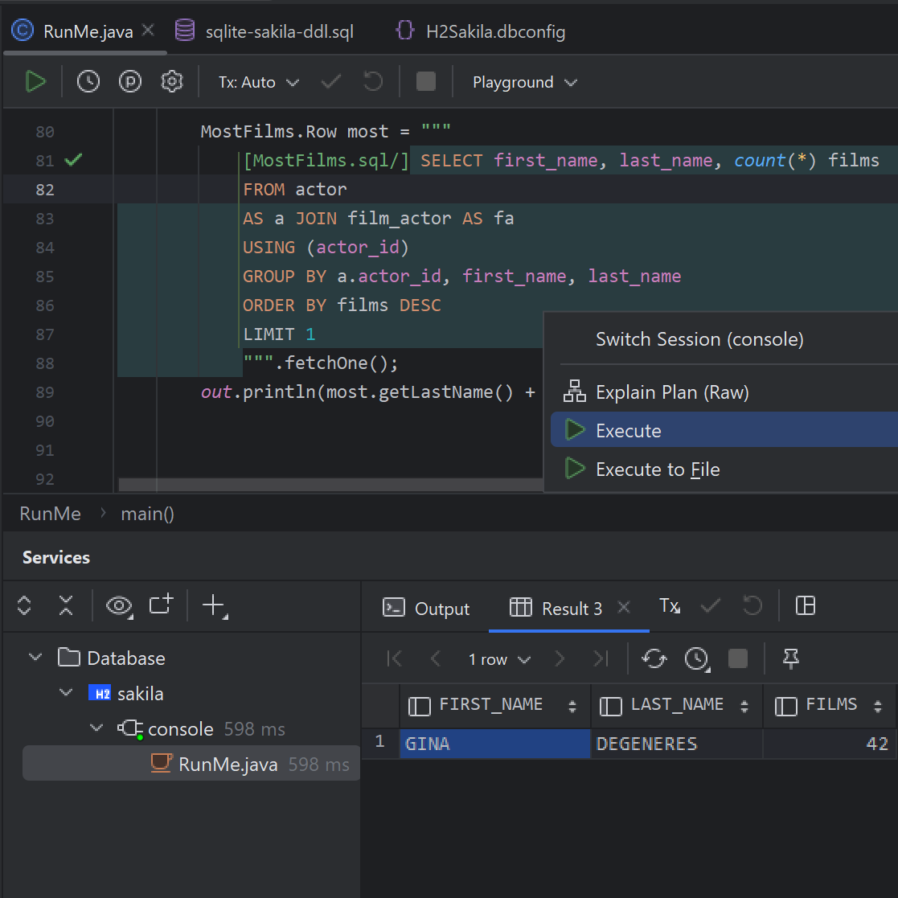
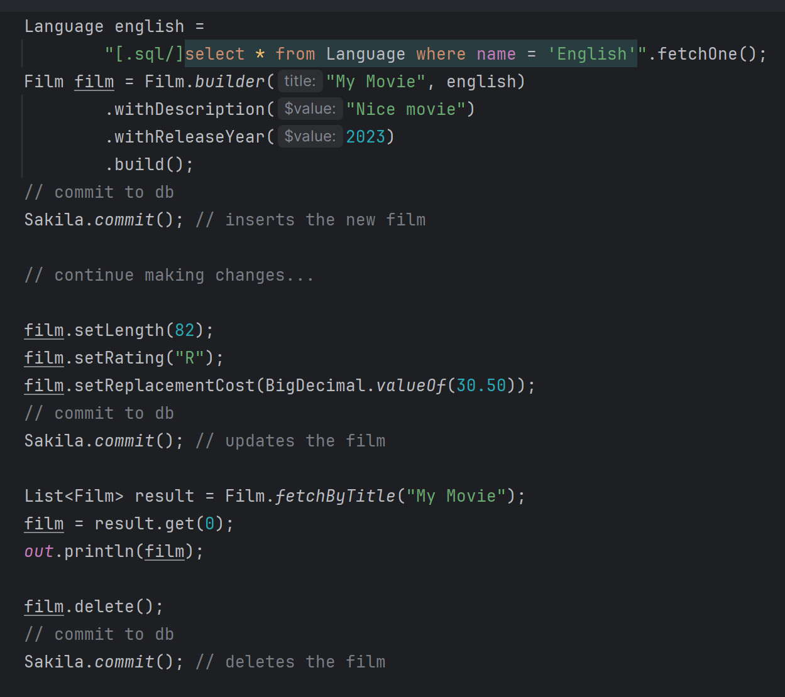

>&#9888; **_Experimental Feature_**

# Manifold SQL


[](https://join.slack.com/t/manifold-group/shared_invite/zt-e0bq8xtu-93ASQa~a8qe0KDhOoD6Bgg)
[](https://github.com/manifold-systems/manifold)


Manifold SQL harnesses your database to let you write native, _type-safe_ SQL _directly_ in your Java code. 


- Query types are instantly available as you type native SQL of any complexity in your Java code
- Query results are type-safe and API-rich and simple to use (see examples below)
- Entity types are automatically derived from your database, providing type-safe CRUD, decoupled TX, and more.
- No ORM, No DSL, No wiring, and No code generation build steps
                 
Use Manifold SQL simply by adding the javac `-Xplugin:Manifold` argument and `manifold-sql` and `manifold-sql-rt` dependencies
to your gradle or maven build. See [Step 1. Add Manifold SQL to your build](#step-1-add-manifold-sql-to-your-build).

---

# Features
- Use native SQL _directly_ and _type-safely_ in your Java project<br>
- Type-safe schemas &nbsp;&bull;&nbsp; Type-safe queries &nbsp;&bull;&nbsp; Type-safe results<br>
- CRUD with schema types derived automatically from your database<br>
- Decoupled transaction scoping, make changes on your own timeline<br>
- No ORM &nbsp;&bull;&nbsp; No DSL &nbsp;&bull;&nbsp; No code gen steps<br>
- Pluggable architecture with simple dependency injection<br>
- Tested with popular JDBC database drivers and SQL dialects<br>
- Comprehensive IDE support (IntelliJ IDEA, Android Studio)
- Supports Java 8 - 21 (LTS releases)

# Examples

You can inline SQL queries and commands in both standard String Literals and Text Blocks. This query demonstrates how
you can use native SQL to produce result sets of any type.


<br>

Notice both Java and SQL syntax are highlighted. The Manifold IntelliJ IDEA plugin integrates with IDEA's SQL features.

---
Query results consist of _entity_ instances and/or _row_ instances, depending on whether all required columns are selected.
As such, `select *` queries conveniently result in entity instances.


<br>

This query also demonstrates the use of type-safe, injection-safe query parameters. Parameters are supported in all SQL
commands including `Insert`, `Update`, `Delete` as well as `Select`.

---
An inline query is purely declarative using comment delimiters.


<br>

Here the `Payments` query type is defined and used in the same local scope. Notice the type declaration, `Payments.sql`
follows the file `name`.`extension` convention. The type name is `Payments` and the type domain is `sql`.

---
With IntelliJ you can interactively execute parameterized SQL queries in your code directly against test data, analyze
query execution plans, and a lot more.


<br>

While IntelliJ is not required to use Manifold SQL, it can boost your development experience significantly.  

---
CRUD operations and transactions are a pleasure with Manifold SQL. Easily make and commit changes however you like.


<br>

`Sakila` is the name of the user-defined database configuration file, which is used to name the schema Java type referenced
here. Note, this example calls `commit()` three times to demonstrate the flexibility of decoupled transactions. See [transaction scopes](#transaction-scopes).

>**ⓘ** The [Manifold SQL sample project](https://github.com/manifold-systems/manifold-sql-sample-project) contains many of the
examples used here. Clone it and start experimenting!

# How does it work?
 
Manifold SQL plugs into the java compiler using the `jdk.compiler.Plugin` SPI. This hook enables the framework to intercept
the compiler's type resolver so that it can generate types on-demand as the compiler encounters them. This unique aspect
of the framework effectively provides _just-in-time_ type generation. It is what makes on-the-fly entity type projection
and inline, type-safe SQL a reality. 
     
A standard JDBC connection supplies the metadata backing the entity and query types. The connection is configured using a simple
JSON structured file, which provides a JDBC URL, driver properties, and other optional settings. Separate configurations 
may be defined for compilation, testing, and production. During compilation the connection is used exclusively to
access metadata to build just-in-time entity and query APIs. Metadata acquired directly from the target database guarantees
these APIs are _always_ 100% type-safe, in-sync, and tailored for use with your specific configuration.
                        
# Documentation

<!-- TOC -->
* [Getting started](#getting-started)
* [Step 1. Add Manifold SQL to your build](#step-1-add-manifold-sql-to-your-build)
  * [Gradle](#gradle)
  * [Maven](#maven)
  * [Binaries](#binaries)
  * [Tested JDBC drivers](#tested-jdbc-drivers)
* [Step 2. Configure your database connection](#step-2-configure-your-database-connection)
  * [`.dbconfig` files](#dbconfig-files)
  * [Naming](#naming)
  * [Compiling vs. testing vs. production](#compiling-vs-testing-vs-production)
  * [Programmatic configuration](#programmatic-configuration)
  * [Accessing the configuration in your code](#accessing-the-configuration-in-your-code)
  * [Settings](#settings)
* [Step 3. Begin writing incredible code!](#step-3-begin-writing-incredible-code-)
  * [Queries](#queries)
    * [`.sql` files](#sql-files)
    * [Query & Row types](#query--row-types)
    * [Entity types](#entity-types)
    * [Inline SQL](#inline-sql)
  * [Entities](#entities)
    * [Entity methods](#entity-methods)
    * [Patching JDBC types](#patching-jdbc-types)
    * [Value accessors](#value-accessors)
    * [Customizing entity types](#customizing-entity-types)
  * [CRUD](#crud)
    * [Create](#create)
    * [Read](#read)
    * [Update](#update)
    * [Delete](#delete)
  * [Transaction scopes](#transaction-scopes)
    * [Default transaction scope](#default-transaction-scope)
    * [`commit()`](#commit)
    * [Have it your way](#have-it-your-way)
  * [DML & DDL commands](#dml--ddl-commands)
  * [Customizations](#customizations)
  * [Dependency interfaces](#dependency-interfaces)
    * [DbConfigProvider](#dbconfigprovider)
    * [ConnectionProvider](#connectionprovider)
    * [CrudProvider](#crudprovider)
    * [DbLocationProvider](#dblocationprovider)
    * [DefaultTxScopeProvider](#defaulttxscopeprovider)
    * [TxScopeProvider](#txscopeprovider)
    * [TypeProvider](#typeprovider)
    * [ValueAccessorProvider](#valueaccessorprovider)
    * [CustomEntityFactory](#customentityfactory)
* [IDE support](#ide-support)
  * [Plugin installation](#plugin-installation)
  * [IntelliJ IDEA Community Edition vs. IDEA Ultimate](#intellij-idea-community-edition-vs-idea-ultimate)
* [Javadoc](#javadoc)
* [License](#license)
* [Versioning](#versioning)
* [Author](#author)
* [Comms](#comms)
<!-- TOC -->

# Getting started

---

---

Be productive with Manifold SQL in three easy steps.
1. Add Manifold SQL to your build
2. Configure your database connection 
3. Begin writing incredible code!

Let's get into it!

# Step 1. Add Manifold SQL to your build 

Manifold SQL consists of two modules:
* `manifold-sql`
* `manifold-sql-rt`

For optimal performance and to work with Android and other JVM languages it is recommended to:
* Add a dependency on `manifold-sql-rt` (Gradle: "implementation", Maven: "compile")
* Add `manifold-sql` to the annotationProcessor path (Gradle: "annotationProcessor", Maven: "annotationProcessorPaths")

Sample build files for Gradle and Maven follow.

## Gradle

>**ⓘ** If you are targeting **Android**, please see the [Android](http://manifold.systems/android.html) docs.

>**ⓘ** if you are using **Kotlin**, please see the [Kotlin](http://manifold.systems/kotlin.html) docs.

Here is a sample `build.gradle` script. Change `targetCompatibility` and `sourceCompatibility` to your desired Java
version (8 - 21), the script takes care of the rest.
```groovy
plugins {
    id 'java'
}

group 'systems.manifold'
version '1.0-SNAPSHOT'

targetCompatibility = 11
sourceCompatibility = 11

repositories {
    jcenter()
    maven { url 'https://oss.sonatype.org/content/repositories/snapshots/' }
}

dependencies {
    
     // Manifold dependencies    
     implementation 'systems.manifold:manifold-sql-rt:2023.1.33'
     annotationProcessor 'systems.manifold:manifold-sql:2023.1.33'
     testAnnotationProcessor 'systems.manifold:manifold-sql:2023.1.33'

     // Add your JDBC driver here, this is just an example using postgres
     implementation 'org.postgresql:postgresql:42.6.0'
     annotationProcessor 'org.postgresql:postgresql:42.6.0'
     testAnnotationProcessor 'org.postgresql:postgresql:42.6.0'
}

if (JavaVersion.current() != JavaVersion.VERSION_1_8 &&
    sourceSets.main.allJava.files.any {it.name == "module-info.java"}) {
    tasks.withType(JavaCompile) {
        // if you DO define a module-info.java file:
        options.compilerArgs += ['-Xplugin:Manifold', '--module-path', it.classpath.asPath]
    }
} else {
    tasks.withType(JavaCompile) {
        // If you DO NOT define a module-info.java file:
        options.compilerArgs += ['-Xplugin:Manifold']
    }
}
```
Use with accompanying `settings.gradle` file:
```groovy
rootProject.name = 'MyProject'
```

## Maven

```xml
<?xml version="1.0" encoding="UTF-8"?>
<project xmlns="http://maven.apache.org/POM/4.0.0" xmlns:xsi="http://www.w3.org/2001/XMLSchema-instance" xsi:schemaLocation="http://maven.apache.org/POM/4.0.0 http://maven.apache.org/maven-v4_0_0.xsd">
    <modelVersion>4.0.0</modelVersion>

    <groupId>com.example</groupId>
    <artifactId>my-sql-app</artifactId>
    <version>0.1-SNAPSHOT</version>

    <name>My App</name>

    <properties>
        <!-- set latest manifold version here --> 
        <manifold.version>2023.1.33</manifold.version>
    </properties>
    
    <dependencies>
        <!-- Add dependency on manifold-sql-rt -->
        <dependency>
            <groupId>systems.manifold</groupId>
            <artifactId>manifold-sql-rt</artifactId>
            <version>${manifold.version}</version>
        </dependency>

        <!-- Add your JDBC driver here, this is just an example using Postgres -->
        <dependency>
            <groupId>org.postgresql</groupId>
            <artifactId>postgresql</artifactId>
            <version>42.6.0</version>
        </dependency>

    </dependencies>

    <!--Add the -Xplugin:Manifold argument for the javac compiler-->
    <build>
        <plugins>
            <plugin>
                <groupId>org.apache.maven.plugins</groupId>
                <artifactId>maven-compiler-plugin</artifactId>
                <version>3.8.0</version>
                <configuration>
                    <source>11</source>
                    <target>11</target>
                    <encoding>UTF-8</encoding>
                    <compilerArgs>
                        <!-- Add manifold plugin-->
                        <arg>-Xplugin:Manifold</arg>
                    </compilerArgs>
                    <!-- Add the processor path for the plugin -->
                    <annotationProcessorPaths>
                        <!-- Manifold SQL -->
                        <path>
                            <groupId>systems.manifold</groupId>
                            <artifactId>manifold-sql</artifactId>
                            <version>${manifold.version}</version>
                        </path>

                        <!-- Add your JDBC driver here, this is just an example using Postgres -->
                        <path>
                            <groupId>org.postgresql</groupId>
                            <artifactId>postgresql</artifactId>
                            <version>42.6.0</version>
                        </path>

                    </annotationProcessorPaths>
                </configuration>
            </plugin>
        </plugins>
    </build>
</project>
```

## Binaries

If you are *not* using Maven or Gradle, you can download the latest binaries [here](http://manifold.systems/docs.html#download).

## Tested JDBC drivers 

Several drivers are tested and more are on the way. But Manifold SQL is designed to work with _any_ Type 4 JDBC driver.
If you experience problems using a JDBC driver with Manifold SQL, please let us know by [reporting the issue](https://github.com/manifold-systems/manifold/issues/new/choose).

| Database   | Tested Driver                              |
|------------|--------------------------------------------|
| H2         | `com.h2database:h2`                        |
| MySQL      | `com.mysql:mysql-connector-j`              |
| Oracle     | `com.oracle.database.jdbc:ojdbc*`          |
| Postgres   | `org.postgresql:postgresql`                |
| SQL Server | `com.microsoft.sqlserver:mssql-jdbc`       |
| SQLite     | `org.xerial:sqlite-jdbc`                   |
| _other_    | report issues, your feedback is important! |

The architecture is designed for [customization](#customizations), you can tweak or completely replace almost every aspect
of its behavior.

# Step 2. Configure your database connection 
            
## `.dbconfig` files

Configuring Manifold SQL is a snap. Just create one or more JSON formatted files with the `.dbconfig` extension. The
primary function of this file is to connect Manifold SQL to your data source via a JDBC driver URL.
```json
{
  "url": "jdbc:postgresql://localhost:5432/sakila?user=postgres&password=password"
}
```
This is the simplest of `.dbconfig` files, and shows that the only required setting is the JDBC `url`. It configures
Manifold to connect to a Postgres database named `sakila` with a user and password following the URL format of the
standard Postgres JDBC driver.

`.dbconfig` files can be thoroughly customized. For instance, you can separate credentials from
the URL, override the default schema type Java package, provide a specific schema name, and much more.

`Sakila.dbconfig`
```json
{
  "url": "jdbc:oracle:thin:@localhost:1521:XE",
  "user": "system",
  "password": "password",
  "schemaPackage": "org.example.schema.types",
  "schemaName": "SAKILA",
  "dbDdl": "samples/ddl/oracle-sakila-ddl.sql",
  . . .
}
```

## Naming

By default, the name of the file is used as the schema type name. For instance, if you create a file named `MyDatabase.dbconfig`,
the schema type name is `MyDatabase`. This type is generated automatically when it is referenced in your code, it is the
entry point to type-safely access the schema's entity types and to perform [CRUD](#entities--crud) operations.  More
on this later.

## Compiling vs. testing vs. production
                                                                              
Although you can use a single `.dbconfig` resource file for both compiling and running your project, this configuration
is most suitable for learning and playing with Manifold SQL. In practice, separate configurations for compilation, testing,
and production are the typical setup. There are several options to choose from in terms of where and how you define your
configurations.

A `.dbconfig` targeting compilation must be defined as a Java resource file and can reside anywhere in your project's
resource path. It is possible to share this file for testing by using the same URL or by providing separate URLs.
To provide separate URLs use `buildUrl` for compiling and `url` for testing.

As with compilation, a `.dbconfig` file targeting runtime (testing or production) may be a resource file, but must reside
in a resource directory named `/config` or, if your project uses `module-info.java` files, it may reside in resource
directory `/<your-module-name>/config`. Consequently, if you use the same `.dbconfig` file for compilation and testing/production,
the file must be a resource file in one of the `/config` locations.

Additionally, a `.dbconfig` file may be placed in the current directory or in a `/config` subdirectory of the current directory.
Current directory locations have precedence over resource path locations and are exclusive to testing and production use.
Note, if using the current directory, be sure to maintain the same exact file name as the resource `.dbconfig` file name
used for compilation.

See the `url` setting documentation for more information about specifying the current directory and other details.

## Programmatic configuration

You may also configure Manifold SQL programmatically by implementing the `DbConfigProvider` interface and using simple
dependency injection. This form of configuration has precedence over `.dbconfig` files.

See [DbConfigProvider](#customizations) customizations for more info.
                                               
## Accessing the configuration in your code

Access the `.dbconfig` configurations type-safely via the `manifold.sql.rt.api.DbConfig` type. For instance, if your
`.dbconfig` file is named `MyDatabase.dbconfig`, you can access it like this:
```java
DbConfig dbConfig = MyDatabase.getDbConfig();
```

## Settings

`.dbconfig` settings are JSON formatted. The following listing specifies each setting name along with the setting type
and whether it is optional, required, or provided. A provided setting is assigned when the .dbconfig file is processed;
a provided setting cannot be overridden.

---
| `name` | `String` | _(provided)_ |
|--------|----------|--------------|

The base name of the `.dbconfig` file. For example, for a file named `MyDatabase.dbconfig`, the base name is `MyDatabase`.
The top-level schema type will have this name, where the schema's tables and views are projected as inner types of
`MyDatabase` e.g., for a schema table named _Film_ its Java entity type will be `MyDatabaes.Film`. 

As a convenience, if a "schemaName" setting is not specified and the JDBC URL does not indicate a schema, this name is
also the name of the schema to fetch in the data source.

This name is automatically assigned by manifold on load of the file, or if this DbConfig was constructed via `DbConfigProvider`
dependency interface, it will be supplied by the implementation.

---
| `catalogName` | `String` | _(optional)_ |
|---------------|----------|--------------|

The database catalog containing the schema. If not explicitly specified, all accessible database catalogs are searched
for a schema matching "schemaName", in no particular order. If "catalogName" is the empty string "", this indicates only
schemas without a catalog will be considered.

Some drivers support naming the catalog in the URL. In this case the catalog name is unnecessary in the dbconfig.

Note, some drivers provide schema names as catalog names i.e., catalogs without schemas. For instance, MySql does this.
In this case the catalog names are queried from the database metadata, but used as schema names. Do not provide the catalog
name if it is not the container of the schema.

---
| `schemaName` | `String` | _(optional)_ |
|--------------|----------|--------------|

The name of the database schema used for this configuration. If not explicitly specified, the dbconfig file name is used
as the schema name. If the file name does not correspond with a schema in the database, a default schema will be selected
automatically.

Note, some drivers provide schema names as catalog names e.g., MySql. In this case the catalog names are queried from the
catalogs of the driver's database metadata.

---
| `path` | `String` | _(provided)_ |
|--------|----------|--------------|

The location of dbconfig file corresponding with this class. This setting is relevant only at compile-time and is
used for logging and debugging.

---
| `url` | `String` | _(required)_ |
|-------|----------|--------------|

JDBC URL for data source. If `buildUrl` is not specified, this URL is used for both compiling and running your code.

The URL string can be templated with `${}` expressions containing either a Java system property or an environment variable. 
```java
"url": "jdbc:h2:file:${user.dir}/mydatabase"
```
Here the URL references a file in the user's current directory.
 
`${}` expressions can be customized using the `#` symbol.
```java
"url": "jdbc:h2:file:${#my_tag arg1, arg2}"
```
Implement the [`DbLocationProvider`](https://github.com/manifold-systems/manifold/blob/a41a0f92c98d6187c2b3b5d0d84b979894e1b7f5/manifold-deps-parent/manifold-sql-rt/src/main/java/manifold/sql/rt/api/DbLocationProvider.java#L30)
interface to handle your custom tags.

---            
| `buildUrl` | `String` | _(optional)_ |
|------------|----------|--------------|

JDBC URL for data source to be used exclusively for compiling. This data source may be void of data, it is used solely for
acquiring metadata during compilation.

See `url` above for more information about encoding the JDBC URL.

---
| `schemaPackage` | `String` | _(optional)_ |
|-----------------|----------|--------------|

The fully qualified package name where schema .class files will be generated. If not provided, the default package will
be used: `sql.schema.types`. Note, this property is used exclusively for compile-time.

---
| `user` | `String` | _(optional)_ |
|--------|----------|--------------|

Username for data source.

---                         
| `password` | `String` | _(optional)_ |
|------------|----------|--------------|

Password for data source.

---         
| `isDefault` | `boolean` | _(optional)_ |
|-------------|-----------|--------------|

If `true`, this dbconfig is the "default" configuration. The default dbconfig is applied to all SQL resources not
qualified with a dbconfig.

If multiple dbconfigs are in use, a SQL resource not intended for the default dbconfig must qualify its name with the
intended dbconfig. 

To use `MyDatabase.dbconfig` a .sql file follows the naming convention. 
```
MyQuery.MyDatabase.sql
```
Inline SQL follows a similar pattern: 
```
"[MyQuery.sql:MyDatabase/] select * from ..."
```

If there is only one dbconfig in use, it is considered default. Consequently, if you are not using multiple dbconfigs in
your project you can ignore this setting.

---            
| `properties` | `Object` | _(optional)_ |
|--------------|----------|--------------|

JDBC connection properties in JSON format. These properties are driver-specific, consult your JDBC driver documentation
for details.

---                                        
| `dbDdl` | `String` | _(optional)_ |
|---------|----------|--------------|

A resource file containing DDL for the database/schema this configuration is using. This is typically obtained as a DDL
dump from the DBMS. This setting is intended for testing and/or compilation e.g., to recreate the database between tests.

---                           
| `customBaseInterface` | `String` | _(optional)_ |
|-----------------------|----------|--------------|

The qualified name of the base _interface_ to be used for generated entity classes, projected from schema tables and
views.

---           
| `customBaseClass` | `String` | _(optional)_ |
|-------------------|----------|--------------|

The qualified name of the base _class_ to be used for generated entity classes. Please note, the Manifold SQL APIs only
expose entity _interfaces_. Public methods on a custom base class will not be exposed in the API, for that you must define
a custom base interface. See `customBaseInterface` above. 

---
| `inMemory` | `boolean` | _(optional)_ |
|------------|-----------|--------------|

(for internal use)
If using the database in-process (in-memory) e.g., jdbc:h2:mem or jdbc:sqlite::memory:, this setting must be
set to `true`, otherwise it is ignored. This setting applies exclusively to manifold-sql-inproc-test.


# Step 3. Begin writing incredible code! 

If you've added Manifold SQL your build and configured your database in one or more .dbconfig files, you're ready to begin
writing incredible code!

Most of the examples here use the [Sakila](https://dev.mysql.com/doc/sakila/en/) sample database originally published for
MySQL. It is now open source and is a great example of a well-designed, normalized schema. 

The [Manifold SQL sample project](https://github.com/manifold-systems/manifold-sql-sample-project) contains many of the
examples used here. Clone it and start experimenting! 

## Queries

---

Manifold SQL lets you use native SQL of any complexity directly and type-safely anywhere in your code. You can define SQL
queries in `.sql` files or _inline_ SQL directly in your Java code.

### `.sql` files

A standard `.sql` file contains a single SQL statement, such as a Select statement, in a dialect supported by your
database. It may contain any number of SQL comments. Additionally, it may define any number of named SQL parameters prefixed
with the `:` character. This is where you would otherwise use `?` characters when using anonymous JDBC encoded parameters.

All `.sql` files must be defined as Java resource files and must reside in your project's resource path.
                   
Query type names match `.sql` file names. For example, the query type for resource file `org/example/queries/Sales.sql`
would be `org.example.queries.Sales` and use the default dbconfig.

If you want a `.sql` file to target a dbconfig other than the default one, you must include it in the file name. For instance,
to use `MyOtherDatabase.dbconfig` with `Sales.sql`, add the dbconfig name as a secondary file extension.
```
`org/example/queries/Sales.MyOtherDatabase.sql`
```

>**ⓘ** Inline SQL follows a similar pattern, but because it supports anonymous types the dbconfig name is appended.
>```java
>"[.sql:MyOtherDatabase/] select * from ..."
>```
>More on [inline](#inline-sql) SQL later.

### Query & Row types

Here is a simple query file providing employee names and email addresses.

`org/example/queries/StaffInfo.sql`
```sql
SELECT first_name, last_name, email FROM staff 
```
Invoke the query type-safely like this:
```java
import org.example.queries.StaffInfo;
. . .
for(StaffInfo.Row row : StaffInfo.fetch()) {
  out.println(row.getFirstName() + ", " + row.getLastName() + ", " + row.getEmail());  
}
```
All SQL queries are compiled as Java interface types matching the name and location of the SQL resource file. Here resource
file _org/example/queries/StaffInfo.sql_ compiles as interface `org.example.queries.StaffInfo`.

Notice the results are provided using the `StaffInfo.Row` type. The `Row` interface type-safely reflects all the query's
selected columns. 

Execute a query using one of the `fetch` methods. In this example `fetch()` returns multiple rows that are iterable using
the `for` statement.

>**ⓘ** Include [manifold-props](https://github.com/manifold-systems/manifold/tree/master/manifold-deps-parent/manifold-props)
>in your project for more concise usage of get/set property methods.
> ```java
> out.println(row.getFirstName() + "," + row.getLastName() + "," + row.getEmail());
> // vs.  
> out.println(row.firstName + "," + row.lastName + "," + row.email);  
> ``` 

### Entity types

Here's another example utilizing query parameters and an _entity_ type.

`org/example/queries/FindRental.sql`
```sql
-- Finds the rental of the customer's returning DVD.
SELECT * FROM rental
WHERE inventory_id = :inventory_id
  AND customer_id = :customer_id
  AND return_date IS NULL
```

Invoke the query type-safely like this:
```java
import org.example.schema.Sakila.*;
import org.example.queries.FindRental;
. . .
Rental rental = FindRental.fetchOne(inv.getInventoryId(), cust.getCustomerId());
LocalDateTime returnDate = rental.getReturnDate();  
```
This example demonstrates that when the selected columns of a query contain all the non-null columns of a selected table,
such as with `select *` queries, the query results consist of _entity_ instances instead of _row_ instances.

Notice the `fetchOne` method matches the parameters in the query and returns just one item, the `Rental`.

Unlike Row interfaces, entities may participate in CRUD operations and are fully customizable.

Parameters are both type-safe and injection-safe.

See [entities](#entities) for fuller coverage of the subject.


### Inline SQL

It is often convenient to read and write SQL directly where your Java code uses it. You can inline a SQL resource
utilizing Java string literals, text blocks, and comments.

Here are the previous SQL resource file examples duplicated as inline SQL.

```java
for(StaffInfo.Row row : "[StaffInfo.sql/] SELECT first_name, last_name, email FROM staff".fetch()) {
  out.println(row.getFirstName() + ", " + row.getLastName() + ", " + row.getEmail());  
}
```

Notice the `[StaffInfo.sql/]` prefix in the query string. Manifold uses this syntax to identify inlined resources. It
instructs the compiler plugin to treat the content of the literal value as an embedded resource file. Thus, the `StaffInfo.sql`
name indicates the content is native SQL and is generated as type `StaffInfo` relative to the enclosing scope.

You can also inline SQL anonymously by eliminating the name. Here is the same example, but without the `StaffInfo` name.
```java
for(var row : "[.sql/] SELECT first_name, last_name, email FROM staff".fetch()) {
  out.println(row.getFirstName() + ", " + row.getLastName() + ", " + row.getEmail());  
}
```
Since the SQL query no longer has a name, we must infer its name using the `var` keyword, otherwise it behaves exactly like
a named SQL statement.

>**ⓘ** Manifold's [auto](https://github.com/manifold-systems/manifold/tree/master/manifold-deps-parent/manifold-ext#type-inference-with-auto)
>feature can be used in Java 8 to achieve the same behavior as the `var` keyword. `auto` is also a bit more versatile, it
>can be used with fields and method return types.

More involved queries can be defined inside Java text blocks.
```java
import org.example.schema.Sakila.*;
. . .
Rental rental = """
  [.sql/] SELECT * FROM rental
  WHERE inventory_id = :inventory_id
    AND customer_id = :customer_id
    AND return_date IS NULL
  """.fetchOne(67, 112);
LocalDateTime returnDate = rental.getReturnDate();  
```
Here we have the same multiline query defined in the `org/example/queries/FindRental.sql` resource file example above.
Notice this query is defined anonymously via `[.sql]`. There is no need for a type name here because there is no need
to explicitly reference the type. This is often the case when inlining SQL with string literals and text blocks. 
                                                                                                              
SQL statements may also be inlined using comment delimiters.
```java
import org.example.schema.Sakila.*;
. . .
/*[FindRental.sql/] 
  SELECT * FROM rental
  WHERE inventory_id = :inventory_id
    AND customer_id = :customer_id
    AND return_date IS NULL
*/
Rental rental = FindRental.fetchOne(67, 112);
LocalDateTime returnDate = rental.getReturnDate();  
```
Use a comment when you prefer to separate the SQL query type from code that executes it. Also, great for formatting SQL
with Java versions prior JDK 15 where text blocks are not available as a standard feature.

Use text blocks to make queries more readable and directly executable.
```java
/** Top N rented movies in descending order */
public void displayPopularMovies(int topN) {
  """
    [.sql/] SELECT title, COUNT(title) as rentals
    FROM film
    JOIN inventory ON (film.film_id = inventory.film_id)
    JOIN rental ON (inventory.inventory_id = rental.inventory_id)
    GROUP by title
    ORDER BY rentals desc
    LIMIT :topN
  """.fetch(topN).forEach(row->out.println(row.getTitle() + ": " + row.getRentals()));
}
```

## Entities

---

Manifold SQL uses your JDBC connection to automatically infer entity interfaces for schema tables and views. You use these
interfaces to process query results and to perform CRUD (Create, Read, Update, Delete) operations on your database.

Your `.dbconfig` file name is the top-level schema type name. Use this to access all the schema's entity interfaces.

Using our sample `Sakila.dbconfig` file we can use the `Country` entity interface like this:
```java
import org.example.schema.Sakila.Country;
```
Or, import all of Sakila's entity interfaces.
```java
import org.example.schema.Sakila.*;
```

### Entity methods

An entity defines conventional get/set properties corresponding with all the table column names. 
```java
City city = "[.sql/] select * from city where city_id = :city_id".fetchOne(cityId);
Long countryId = city.getCountryId();
```
"fetch" methods load entities corresponding with primary keys, foreign keys, and non-null columns.
```java
City city = City.fetch(cityId);
Country country = city.fetchCountryRef();
List<City> cities = City.fetchByCountryId(country.getCountryId());
```
One-to-many and many-to-many relations are also covered with "fetch" methods.
```java
Country country = Country.fetch(countryId);
for(City c : country.fetchCityRefs()) out.println(c.city);
```

Note, "fetch" methods are lazy, their values are never pre-fetched. One-to-many and many-to-many methods never cache values
and always query the database. This behavior is fully customizable, see [customizing entity types](#customizing-entity-types).

As covered in the [CRUD](#crud) section below, entities define static methods for creating, building, and fetching. There
are also instance methods for deleting and undeleting.
 

### Patching JDBC types

The `TypeProvider` dependency interface provides the JDBC type for schema columns, query columns, and parameters. It may
override the type obtained from the JDBC driver. For example, sometimes it is helpful to use alternative numeric types
that better reflect the database's SQL type.

In turn, `ValueAccessor` implementations use the JDBC type obtained from the `TypeProvider` to provide the Java class
used in the entity and query APIs. You can override the `TypeProvider` to use your own `ValueAccessor` implementations.

### Value accessors

Entity properties are typed based on JDBC column metadata. The JDBC types and corresponding Java types are controlled
using `ValueAccessor` implementations and dependency injection. See [ValueAccessProvider](#valueaccessorprovider) below.

### Customizing entity types

The Java code generated for the entity API is thoroughly customizable. You can:
- provide a custom base interface, which will be a super interface to all generated entity interfaces. See the `customBaseInterface` setting in DbConfig [Settings](#settings).
- provide a custom base class, which will be the super class of all generated entity classes. See the `customBaseInterface` setting in DbConfig [Settings](#settings).
- completely control entity instance creation via `CustomEntityFactory`. See [Customizations](#customizations).
- provide custom interfaces per entity using a simple naming convention.
  For example, to provide a custom interface for entity `Actor` the custom interface must be a top-level source file named `CustomActor.java` anywhere in your project and follow this naming convention:
  ```java
  public interface CustomActor extends CustomEntity<Actor> {...}
  ```
  This naming convention makes it easy to customize the entity API using default interface methods.
  ```java
  public interface CustomActor extends CustomEntity<Actor> {
    default String myActorMethod() {
      Actor actor = self();
      ...
      return "hello";
    }
  }                         
  . . .
  Actor actor = getActor();
  actor.myActorMethod();
  ```                                                                                                                           
- You can add custom methods to _any_ type using [extension classes](https://github.com/manifold-systems/manifold/tree/master/manifold-deps-parent/manifold-ext#extension-classes-via-extension).
This mode of customization applies to all types, not just Manifold SQL APIs.
                       
## CRUD

---

You can write CRUD (Create, Read, Update, Delete) operations using [native SQL commands](#dml--ddl-commands) such as INSERT,
SELECT, UPDATE, and DELETE. However, these operations tend to be repetitive, resulting in a lot of error-prone, boilerplate
code. Entity interfaces provide an API to simplify common CRUD operations.  

>**ⓘ** It is possible to customize CRUD operations by overriding the default implementation. See [CrudProvider](#crudprovider).

### Create

You can make new instances of entity types by invoking a `create` or `builder` method directly from the interface.

The `create` method defines parameters matching the database table's required columns.
```java
import org.example.schema.Sakila.*;
. . .
String name = "Gibberish";  
Language gibberish = Language.create(name);
```
In this case just the `name` column is required. Note, the `language` table's primary key is auto-incremented, therefore
it is not a parameter.

The create method creates a new instance of `Language`, but does not commit it to the database. More on [that](#transaction-scopes)
later.

If there are required foreign keys, you can use foreign key IDs or use entity instances corresponding with the foreign key.
```java
. . .
Film pigglywiggly = Film.create("Pigglywiggly", gibberish);
```
Here we use `gibberish`, the `Language` instance created earlier. Note, we _have_ to pass the instance as there is no foreign
key id available for `gibberish` because it has not yet been committed to the database. We'll cover [transactions](#transaction-scopes)
shortly, but this example demonstrates how entities automatically handle foreign key assignment for you, both to and from
storage. 

Similar to `create` methods, `builder` methods are available to conveniently construct entity instances using a fluent API.
```java
. . .
Film pigglywiggly = Film.builder("Pigglywiggly", gibberish)
  .withReleaseYear(1987)
  .build();
```
Optional database columns such as `release_year` are assignable using `with` methods.

### Read

Use type-safe, native SQL queries of any complexity.  Or, use `fetch` methods to load entities.

```java
List<Film> films = "[.sql/] select * from film where release_date > :releaseData".fetch(2005);
```
Notice the query results above are provided as `Film` entity instances. This means you can execute type-safe queries
to find entities and then directly perform CRUD operations on the results.
```java
film.setReleaseData(2008);
```

"fetch" methods provide quick access by primary key, foreign key, one-many/many-many relationships, etc. 
```java
List<Film> films = Film.fetchByReleaseDate(1987);
```

### Update

Updates amount to calling setter methods on entities whenever/wherever you like.
                                             
```java
Film pigglywiggly = "[.sql/] select * from film where name = 'pigglywiggly'";
pigglywiggly.setReleaseYear(1988);
```
As this example demonstrates, you can simply make changes using standard Java setter methods. Changes are collected until
they are committed via [transaction scope](#transaction-scopes).

You can also use type-safe SQL commands to perform targeted and/or mass updates more efficiently. See [DML & DDL commands](#dml--ddl-commands).
```java
Sakila.addSqlChange(ctx -> {
  "[.sql/] UPDATE rental SET return_date = NOW() WHERE rental_id = :rentId".execute(ctx, getRendId());
});
```

### Delete

To delete an entity call the `delete` method.
```java
Film film = getFilmFromSomewhere();
film.delete();
```
You can undelete too.
```java
film.undelete();
```

You can also use type-safe SQL commands to perform targeted and/or mass updates more efficiently. See [DML & DDL commands](#dml--ddl-commands).
```java
String country = "United States";
. . .
Sakila.addSqlChange(ctx -> {
  "[.sql/] DELETE FROM country WHERE country = :country".execute(ctx, country);
});
```

## Transaction scopes

---

Entity instances, such as `Film` and `Language`, always belong to a _transaction scope_. The purpose of the transaction
scope is to decouple entity changes from the database transaction. That is, the timeline and scoping of entity changes
are separated from the timeline and scoping of persisting entity changes.

Initially, when you read an entity from storage using a query or fetch method, the transaction scope has no reference to
it because it hasn't changed. Only when you create, update, or delete an entity, is it added to the transaction scope as
a change.

When you are ready to commit changes, you simply call the transaction scope's `commit` method. This method completely manages the
transaction: it opens and closes the data source connection, translates entity changes to DML operations, and ensures the
commit is atomic. As a result, the timeline and scoping of entity changes are nicely decoupled from the persistence scope. 

### Default transaction scope

Typically, you can happily ignore transaction scopes by using the default transaction scope, which is built into the entity
API implementation.

Most of the API methods involving a transaction scope make it optional by defining two versions of the method, one with
a `TxScope` argument and one without. Choosing the one without uses the default `TxScope`, which is a thread-local instance.
Essentially, the API encapsulates a default transaction scope to make it simple to avoid having to create or use them beyond
calling `commit`.

For example, all `create` methods have two versions. 
```java
Film.create("My Title", myLanguageId);
Film.create(myTxScope, "My Title", myLanguageId);
```
Unless you need to manage your own `TxScope`, you can select the first one, which uses the default scope.

If using the default cope, as a convenience you may call `commit` using the top-level schema type, which matches the name
of your dbconfig file.
```java
Sakila.commit();
```
This is another example where the API encapsulates the default scope, it also makes good sense to call `commit` from the
schema name!

The default scope is thread-local to enable the separation and processing of independent transactions in a thread-safe
manner. Additionally, the default scope is a pluggable dependency, which allows it to be completely replaced or subclassed.
For example, a default scope more suitable for web requests could be configured to replace the standard default scope.
See [DefaultTxScopeProvider](#defaulttxscopeprovider).

      
### `commit()`

As mentioned the `commit` method is the primary function of the transaction scope. It manages the entire database transaction,
beginning to end. In a nutshell, if there are changes to commit, it opens the data source connection, translates changes
to ordered DML operations, reconciles entity state, and closes the connection.

If `commit` succeeds, the state of all the entity instances reflects the full state of the corresponding records in storage,
including all generated, default, auto-increment, and foreign key columns. If `commit` fails, the changes roll back and
the state of all the entity instances involved revert to their state immediately before the call to `commit`. 
```java
Country canada = Country.create("Canada");
City otherCityMyCountry = City.create("Ottawa", canada);
. . .
Country mexico = Country.create("Mexico");
City myCityMyCountry = City.create("Puebla", mexico);
. . .
Sakila.commit();
```
Here, if `commit` succeeds, all the primary and foreign keys involved are assigned to reflect the database state. Otherwise,
if `commit` fails, entity state goes back to where it was immediately before the `commit` call. From there you can choose
to abandon the changes, revert the changes back to the prior commit, or make adjustments and retry the commit.

Life continues after the commit for both the entities and the transaction scope. As a result, a transaction
scope may span multiple commits, where you can continue to make changes to entities. A subsequent call to commit processes
changes made after the prior commit, and so on.
          
### Have it your way

You may also create your own transaction scope _instances_ with the `TxScope#newScope` method.
```java
TxScope txScope = Sakila.newScope();
. . .
Country canada = Country.create(txScope, "Canada");
City otherCityMyCountry = City.create(txScope,, "Ottawa", canada);
. . .
txScope.commit();
```
Managing your own transaction scopes may be necessary, for example, if you are modifying the same entity in different threads.

Custom `TxScope` implementations via simple dependency injection is another option. This is covered in the [Customizations](#customizations)
section.

## DML & DDL commands

---

In addition to `select` statements SQL files and inline statements also work with other kinds of native SQL, including:
- Data Manipulation Language (DML), statements include `insert`, `update`, and `delete`
- Data Definition Language (DDL), statements such as `create table` and `alter table`
- Generally, any SQL statement that returns nothing

Since these types of statements make changes to the database, they must execute within a [transaction scope](#transaction-scopes),
just like [CRUD](#crud) operations on entities. This is achieved via `TxScope#addSqlChange`.
```java
String country = "United States";
. . .
Sakila.addSqlChange(ctx -> {
  "[.sql/] DELETE FROM country WHERE country = :country".execute(ctx, country);
});
```
Notice the `execute` method requires the `ctx` parameter, which is supplied exclusively by the transaction scope. This
ensures SQL commands execute only from calls to `addSqlChange`, which enables such changes to be bundled within the same
transaction scope as other DML statements and CRUD operations.

This example also illustrates how type-safe, injection-safe SQL parameters can be used with any SQL command.

## Customizations

---

Just about any aspect of Manifold SQL can be tailored, overridden, and/or replaced using simple dependency injection.
This amounts to implementing the `Dependencies` service provider interface (SPI). You can either subclass the Manifold SQL
`DefeaultDependencies` class and override whichever interfaces you like, or directly implement `Dependencies` and delegate
to `DefeaultDependencies` for default behavior. Whichever is more suitable for your needs.
                                                                                          
Because Manifold SQL is used to _compile_ your project, your `Dependencies` implementation class must be compiled before it
can be used in your project. This means your implementation class must be defined in a separate module in your project
or in a separate project.

It's usually good idea to self register your `Dependencies` implementation. This way your project build file can simply
add your implementing module as a dependency. Follow these standard steps to register your SPI implementation class.
1. Create a file named `manifold.sql.rt.api.Dependencies` in `resources/META-INF/services`. For example, normally this file will be in `src/main/resources/META-INF/services`.
2. The contents of this file must contain the qualified name of your implementing class followed by a new line:
```
org.example.MyDependencies

```
In addition to adding a normal implementation dependency on your `Dependencies` module, you must also add an annotation processor
dependency. For gradle:
```groovy
dependencies {
    . . .
    implementation 'org.example.my-manifold-sql-custom-dependencies:0.1-SNAPSHOT'
    annotationProcessor 'org.example.my-manifold-sql-custom-dependencies:0.1-SNAPSHOT'
}
```
For maven:
```xml
<dependencies>
    . . .
    <dependency>
        <groupId>org.example</groupId>
        <artifactId>my-manifold-sql-custom-dependencies</artifactId>
        <version>0.1-SNAPSHOT</version>
    </dependency>
</dependencies>
. . .
<build>
  <plugins>
      <plugin>
          <groupId>org.apache.maven.plugins</groupId>
          <artifactId>maven-compiler-plugin</artifactId>
          . . .
          <configuration>
              . . .
              <annotationProcessorPaths>
                  <path>
                      <groupId>systems.manifold</groupId>
                      <artifactId>manifold-sample-sql-dependencies-project</artifactId>
                      <version>0.1-SNAPSHOT</version>
                  </path>
              </annotationProcessorPaths>
          </configuration>
      </plugin>
  </plugins>
</build>
```

See [Step 1: Adding manifold-sql to your build](#step-1-add-manifold-sql-to-your-build) for complete instructions to add
Manifold SQL to your build.

See [Customizing entity types](#customizing-entity-types) for more ways to customize the schema/entity API.
                               
## Dependency interfaces

The configurable types provided by the `Dependences` SPI include the following interfaces.

---
### DbConfigProvider
    
[manifold.sql.rt.api.DbConfigProvider](https://github.com/manifold-systems/manifold/blob/3155df0797fec4c993d1759e942db27ca86f814f/manifold-deps-parent/manifold-sql-rt/src/main/java/manifold/sql/rt/api/DbConfigProvider.java#L19)

Abstracts the loading of .dbconfig files. 

The default implementation searches the following locations in order:<br>

- `<user.dir>`/config
- `<user.dir>`
- `<resource-path>`/`<current-module-name>`/config _(JDK 11+)_
- `<resource-path>`/config _(JDK 8+)_

Custom implementations may change any aspect of loading .dbconfig files.

---
### ConnectionProvider

[manifold.sql.rt.api.ConnectionProvider](https://github.com/manifold-systems/manifold/blob/3155df0797fec4c993d1759e942db27ca86f814f/manifold-deps-parent/manifold-sql-rt/src/main/java/manifold/sql/rt/api/ConnectionProvider.java#L25)

Provides JDBC connections corresponding with .dbconfig settings.

The default implementation uses [HikariCP](https://github.com/brettwooldridge/HikariCP).

---
### CrudProvider

[manifold.sql.rt.api.CrudProvider](https://github.com/manifold-systems/manifold/blob/c0b72d5e9585cc51efe97c775c2baeb15808ae9b/manifold-deps-parent/manifold-sql-rt/src/main/java/manifold/sql/rt/api/CrudProvider.java#L22)

Performs CRUD operations on entity types. 

---
### DbLocationProvider
                      
[manifold.sql.rt.api.DbLocationProvider](https://github.com/manifold-systems/manifold/blob/c0b72d5e9585cc51efe97c775c2baeb15808ae9b/manifold-deps-parent/manifold-sql-rt/src/main/java/manifold/sql/rt/api/DbLocationProvider.java#L30)

Handles custom `#` tags in the `url` dbconfig setting.
```java
"url": "jdbc:h2:file:${#my_tag arg1, arg2, ...}"
```
The default implementation handles the `#resource` and `#resource_script` tags, which are primarily for internal tests.

---
### DefaultTxScopeProvider

[manifold.sql.rt.api.DefaultTxScopeProvider](https://github.com/manifold-systems/manifold/blob/c0b72d5e9585cc51efe97c775c2baeb15808ae9b/manifold-deps-parent/manifold-sql-rt/src/main/java/manifold/sql/rt/api/DefaultTxScopeProvider.java#L26)

Provides the default scope used in entity and SQL execution method signatures _not_ providing an explicit `TxScope` parameter.

The default implementation provides thread-local TxScopes. A custom implementation could, for example, provide web request
TxScopes.

---
### TxScopeProvider
                   
[manifold.sql.rt.api.TxScopeProvider](https://github.com/manifold-systems/manifold/blob/c0b72d5e9585cc51efe97c775c2baeb15808ae9b/manifold-deps-parent/manifold-sql-rt/src/main/java/manifold/sql/rt/api/TxScopeProvider.java#L19)

The factory for `TxScope` instances.

The default implementation makes `BasicTxScope` instances.

---
### TypeProvider

[manifold.sql.rt.api.TypeProvider](https://github.com/manifold-systems/manifold/blob/c0b72d5e9585cc51efe97c775c2baeb15808ae9b/manifold-deps-parent/manifold-sql-rt/src/main/java/manifold/sql/rt/api/TypeProvider.java#L21)

The `TypeProvider` dependency interface provides JDBC types to correspond with schema columns, query columns, and parameters.

The default implementation may override the type obtained from the JDBC driver. Sometimes this is necessary to correct,
for example, numeric types from the driver that don't pair well with the database's SQL type.

You can implement this dependency to control JDBC types used at any granularity: everything, driver, database, table, column.

In turn `ValueAccessor` implementations use the JDBC type obtained from the `TypeProvider` to infer the Java types used
in the generated entity and query APIs. See [ValueAccessorProvider](#valueaccessorprovider).

---
### ValueAccessorProvider
        
[manifold.sql.rt.api.ValueAccessorProvider](https://github.com/manifold-systems/manifold/blob/c0b72d5e9585cc51efe97c775c2baeb15808ae9b/manifold-deps-parent/manifold-sql-rt/src/main/java/manifold/sql/rt/api/ValueAccessorProvider.java#L19)

Provides the `ValueAccessor` instances corresponding with JDBC types.

You can use this dependency to override `ValueAccessor` instances with your own implementations. 

---
### CustomEntityFactory

[manifold.sql.rt.api.CustomEntityFactory](https://github.com/manifold-systems/manifold/blob/c0b72d5e9585cc51efe97c775c2baeb15808ae9b/manifold-deps-parent/manifold-sql-rt/src/main/java/manifold/sql/rt/api/CustomEntityFactory.java#L19)

Constructs entity classes implementing the entity API interfaces.

>&#9888; There is a good chance you should be customizing the entity _interface_, not the entity class. This is because entity
interfaces are _self implementing_, meaning they delegate behavior using default methods. All the state backing an interface
is obtained via the `getBindings()` call, which is the only entity interface method requiring class implementation. As a
consequence, custom interfaces typically follow along and self implement custom methods, relieving you of having to create
a custom entity class. See [customizing entities types](#customizing-entity-types).

If you do create a custom entity class to go along with your custom entity interface, it must:
- extend `BaseEntity` or a custom base class, see [customizing entities types](#customizing-entity-types)
- implement the corresponding entity interface (_not_ a custom interface)
- provide a public constructor with a `TxBindings` parameter that forwards the argument to `BaseEntity`
```java
import org.example.schema.Sakila.Address;
import manifold.sql.rt.api.TxBindings;

public class MyAddress extends BaseEntity implements Address {
  private MyAddress(TxBindings bindings) {
    super(bindings);
  }

  // your custom code here...

}
```

# IDE support

Manifold is fully supported in [IntelliJ IDEA](https://www.jetbrains.com/idea/download) and [Android Studio](https://developer.android.com/studio).

## Plugin installation

Get the [Manifold plugin](https://plugins.jetbrains.com/plugin/10057-manifold) directly from within the IDE via:

<kbd>Settings</kbd> ➜ <kbd>Plugins</kbd> ➜ <kbd>Marketplace</kbd> ➜ search: `Manifold`

<p></p>

## IntelliJ IDEA Community Edition vs. IDEA Ultimate

JetBrains is generous with features offered in Community edition, as a consequence a lot of Java projects can be developed
with Community and still maintain a high quality dev experience. But one area where Ultimate separates from Community
is SQL support. Ultimate is packed with excellent SQL features, which are well worth the investment if you are developing
an application that involves relational database access. Manifold integrates nicely with all of these features, such as
native SQL code completion, syntax highlighting, query execution, and more.

All the same, Manifold SQL is available and free for both IntelliJ products: type-safe native SQL, inline SQL, CRUD, etc.
Additionally, in both products Manifold SQL supports SQL error feedback in Java editors and SQL files as you type SQL
commands. You'll know instantly whether your SQL is valid and, if not, what is wrong.

# Javadoc

`manifold-sql`:<br>
[](https://javadoc.io/doc/systems.manifold/manifold-sql/2023.1.33)

`manifold-sql-rt`:<br>
[](https://javadoc.io/doc/systems.manifold/manifold-sql-rt/2023.1.33)

# License

Manifold is free, open source software and licensed with [Apache 2.0](http://www.apache.org/licenses/LICENSE-2.0).

# Versioning

For the versions available, see the [tags on this repository](https://github.com/manifold-systems/manifold/tags).

# Author

* [Scott McKinney](mailto:scott@manifold.systems)

# Comms

Start a discussion on [slack](https://join.slack.com/t/manifold-group/shared_invite/zt-e0bq8xtu-93ASQa~a8qe0KDhOoD6Bgg).

Report an [issue](https://github.com/manifold-systems/manifold/issues/new/choose).

If you prefer email, [info@manifold.systems](mailto:info@manifold.systems).
