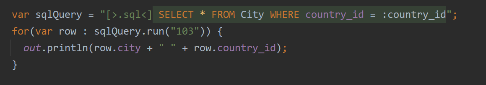

# Manifold : SQL

>**⚠ _Experimental Feature_**
                   
- Use actual SQL directly and type-safely in your Java code. 
- No code generator build steps. No ORM shenanigans. No DSL mumbo-jumbo. It just works. 
- Type-safe DDL. Type-safe queries. Type-safe results. 
- Embed SQL directly in Java source. Or, use .sql files. 
- All JDBC database drivers and dialects fully supported. 
                                                      

Coming soon. . .

