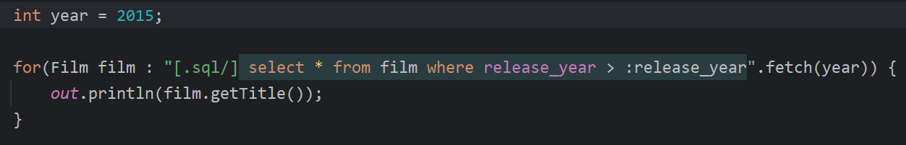

>&#9888; **_Experimental Feature_**

# Manifold SQL

Manifold SQL harnesses your database to let you write native, _type-safe_ SQL _directly_ in your Java code.

- Query types are instantly available as you type native SQL of any complexity in your Java code
- Query results are type-safe and API-rich and simple to use (see examples below)
- Entity types are automatically derived from your database, providing type-safe CRUD, decoupled TX, and more.
- No ORM, No DSL, No wiring, and No code generation build steps

Use Manifold SQL simply by adding the javac `-Xplugin:Manifold` argument and `manifold-sql` and `manifold-sql-rt` dependencies
to your gradle or maven build. See [Step 1. Add Manifold SQL to your build](#step-1-add-manifold-sql-to-your-build).

---

# Features
- Use native SQL _directly_ and _type-safely_ in your Java project 
- Type-safe schemas &nbsp;&bull;&nbsp; Type-safe queries &nbsp;&bull;&nbsp; Type-safe results 
- CRUD with schema types derived automatically from your database 
- Decoupled transaction scoping, make changes on your own timeline 
- No ORM &nbsp;&bull;&nbsp; No DSL &nbsp;&bull;&nbsp; No code gen steps 
- Pluggable architecture with simple dependency injection 
- Tested with popular JDBC database drivers and SQL dialects 
- Comprehensive IDE support (IntelliJ IDEA, Android Studio)
- Supports Java 8 - 21 (LTS releases)

# Examples

You can inline SQL queries and commands in both standard String Literals and Text Blocks. This query demonstrates how
you can use native SQL to produce result sets of any type.

 

Notice both Java and SQL syntax are highlighted. The Manifold IntelliJ IDEA plugin integrates with IDEA's SQL features.

---
Query results consist of _entity_ instances and/or _row_ instances, depending on whether all required columns are selected.
As such, `select *` queries conveniently result in entity instances.

 

This query also demonstrates the use of type-safe, injection-safe query parameters. Parameters are supported in all SQL
commands including `Insert`, `Update`, `Delete` as well as `Select`.

---
An inline query is purely declarative using comment delimiters.

 

Here the `Payments` query type is defined and used in the same local scope. Notice the type declaration, `Payments.sql`
follows the file `name`.`extension` convention. The type name is `Payments` and the type domain is `sql`.

---
With IntelliJ you can interactively execute parameterized SQL queries in your code directly against test data, analyze
query execution plans, and a lot more.

 

While IntelliJ is not required to use Manifold SQL, it can boost your development experience significantly.

---
CRUD operations and transactions are a pleasure with Manifold SQL. Easily make and commit changes however you like.

 

`Sakila` is the name of the user-defined database configuration file, which is used to name the schema Java type referenced
here. Note, this example calls `commit()` three times to demonstrate the flexibility of decoupled transactions. See [transaction scopes](#transaction-scopes).

>**ⓘ** The [Manifold SQL sample project](https://github.com/manifold-systems/manifold-sql-sample-project) contains many of the
examples used here. Clone it and start experimenting!

# How does it work?

Manifold SQL plugs into the java compiler using the `jdk.compiler.Plugin` SPI. This hook enables the framework to intercept
the compiler's type resolver so that it can generate types on-demand as the compiler encounters them. This unique aspect
of the framework effectively provides _just-in-time_ type generation. It is what makes on-the-fly entity type projection
and inline, type-safe SQL a reality.

A standard JDBC connection supplies the metadata backing the entity and query types. The connection is configured using a simple
JSON structured file, which provides a JDBC URL, driver properties, and other optional settings. Separate configurations
may be defined for compilation, testing, and production. During compilation the connection is used exclusively to
access metadata to build just-in-time entity and query APIs. Metadata acquired directly from the target database guarantees
these APIs are _always_ 100% type-safe, in-sync, and tailored for use with your specific configuration.
                        
